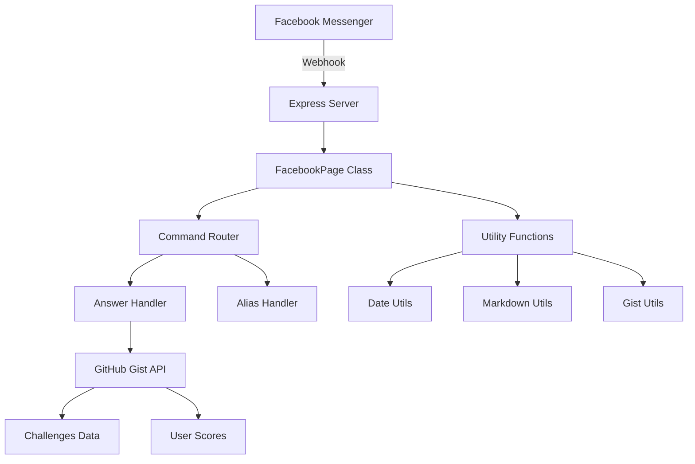

# CyberServer - Facebook Messenger CTF Bot

A Facebook Messenger bot framework designed for Capture The Flag (CTF) competitions, built with Node.js and Express.

## 📋 Table of Contents

- [Overview](#overview)
- [Features](#features)
- [Architecture](#architecture)
- [Installation](#installation)
- [Configuration](#configuration)
- [Usage](#usage)
- [API Reference](#api-reference)
- [Project Structure](#project-structure)
- [Development](#development)
- [Contributing](#contributing)
- [License](#license)

## 🎯 Overview

CyberServer is a specialized Facebook Messenger bot framework designed for running CTF (Capture The Flag) competitions. It provides automated challenge management, flag validation, team scoring, and real-time communication through Facebook Messenger.

### Key Components

- **Facebook Page Bot Framework**: Core messaging and webhook handling
- **CTF Challenge System**: Flag validation and progression management
- **GitHub Gist Integration**: Data persistence for challenges and user scores
- **Utility Functions**: Date handling, markdown formatting, and more

## ✨ Features

- 🤖 **Facebook Messenger Integration**: Full webhook support for real-time messaging
- 🏁 **CTF Flag Management**: Automated flag validation and challenge progression
- 👥 **Team Management**: Multi-player team support with individual scoring
- 📊 **Data Persistence**: GitHub Gist integration for storing challenges and scores
- ⏰ **Time-based Challenges**: Due date validation for time-sensitive challenges
- 🎨 **Rich Text Formatting**: Unicode character conversion for enhanced messaging
- 🔧 **Extensible Command System**: Easy-to-add custom commands and handlers
- 📁 **Static File Serving**: Support for assets and temporary files

## 🏗️ Architecture



### Core Components

1. **FacebookPage Class** (`facebook-page/index.js`)
   - Main bot framework
   - Webhook handling
   - Message routing
   - Command management

2. **Answer Handler** (`src/answer.js`)
   - Flag validation logic
   - Challenge progression
   - Score management

3. **Utility Modules** (`utils/`)
   - Date/timezone handling
   - GitHub Gist integration
   - Text formatting

## 🚀 Installation

### Prerequisites

- Node.js (v14 or higher)
- npm or yarn
- Facebook Developer Account
- GitHub Account (for Gist integration)

### Setup

1. **Clone the repository**
   ```bash
   git clone <repository-url>
   cd CyberServer
   ```

2. **Install dependencies**
   ```bash
   npm install
   ```

3. **Configure environment variables**
   ```bash
   cp .env.sample .env
   ```

4. **Set up Facebook App**
   - Create a Facebook App at [Facebook Developers](https://developers.facebook.com/)
   - Set up Messenger webhook
   - Get your Page Access Token

5. **Set up GitHub Gist**
   - Create a GitHub Personal Access Token
   - Create a new Gist for data storage

## ⚙️ Configuration

### Environment Variables

Create a `.env` file with the following variables:

```env
# Facebook Page Access Token
FB_TOKEN=your_facebook_page_access_token

# Webhook verification token
KEY_TOKEN=your_webhook_verification_token

# GitHub Gist integration
GIST_TOKEN=your_github_personal_access_token
GIST_ID=your_gist_id

# Optional: Server port (default: 3000)
PORT=3000
```

### Facebook Webhook Setup

1. **Webhook URL**: `https://your-domain.com/webhook`
2. **Verify Token**: Use the same value as `KEY_TOKEN`
3. **Subscription Fields**: `messages`, `messaging_postbacks`

### Data Structure

The bot expects two JSON files in your GitHub Gist:

#### `challenges.json`
```json
[
  {
    "flag": "flag_sample",
    "next": {
      "title": "Sample Title",
      "description": "Sample Description",
      "hints": ["sample hint"]
    },
    "due_date": "12-31-2025"
  }
]
```

#### `matches.json`
```json
[
  {
    "id": "user1_user2",
    "players": {
      "user1": 1,
      "user2": 1
    },
    "failed": 0
  }
]
```

## 🎮 Usage

### Starting the Server

```bash
node index.js
```

The server will start on the configured port (default: 3000).

### Bot Commands

The bot supports the following commands:

#### Built-in Commands

- **Help**: `:help` - Display available commands
- **Flag Submission**: `iTP{flag_content}` - Submit CTF flags
- **Nickname**: `nickname [name]` - Set user nickname

#### Command Configuration

Commands are configured in `index.js`:

```javascript
api.addCommand("answer", {
  title: "Flag for CTF",
  command: "iTP{([\\w\\W]+)}",
  hidden: true,
  unprefix: true,
  any: true,
  ci: false,
});
```

### Command Properties

- `title`: Display name for the command
- `command`: Regex pattern to match
- `hidden`: Hide from help menu
- `unprefix`: Don't require command prefix
- `any`: Match anywhere in message
- `ci`: Case insensitive matching

## 📚 API Reference

### FacebookPage Class

#### Constructor
```javascript
const FacebookPage = require('./facebook-page');
const bot = new FacebookPage();
```

#### Methods

##### `addCommand(script, command)`
Add a new command handler.

```javascript
bot.addCommand("mycommand", {
  title: "My Command",
  command: "mycommand (.*)",
  description: "Does something cool"
});
```

##### `setPrefix(prefix)`
Set the command prefix.

```javascript
bot.setPrefix(":");
```

##### `sendMessage(message, event, callback)`
Send a message to a user.

```javascript
bot.sendMessage("Hello World!", event);
```

##### `sendAttachment(fileType, fileUrl, event, callback)`
Send an attachment.

```javascript
bot.sendAttachment("image", "https://example.com/image.png", event);
```

##### `addAdmin(adminID)`
Add an admin user.

```javascript
bot.addAdmin("facebook_user_id");
```

##### `listen(callback)`
Start the bot server.

```javascript
bot.listen((app) => {
  console.log("Bot is running!");
});
```

### Utility Functions

#### Date Utils (`utils/date.js`)
```javascript
const date = require('./utils/date');
const now = date(); // Current time in Asia/Manila
const custom = date('2025-12-31 23:59:59', 'Asia/Manila');
```

#### Gist Utils (`utils/gist.js`)
```javascript
const { get, post } = require('./utils/gist');

// Read data
const data = await get('challenges.json');

// Write data
await post('challenges.json', newData);
```

#### Markdown Utils (`utils/markdown.js`)
```javascript
const markdown = require('./utils/markdown');
const formatted = markdown('Hello World'); // Returns bold Unicode text
```

## 📁 Project Structure

```
CyberServer/
├── facebook-page/           # Bot framework
│   ├── index.js            # Main FacebookPage class
│   └── web/                # Static web files
│       └── index.html      # Landing page
├── src/                    # Command handlers
│   └── answer.js          # Flag validation logic
├── utils/                  # Utility functions
│   ├── date.js            # Date/timezone utilities
│   ├── gist.js            # GitHub Gist integration
│   └── markdown.js        # Text formatting
├── index.js               # Application entry point
├── package.json           # Dependencies and scripts
├── .env.sample           # Environment variables template
└── .gitignore            # Git ignore rules
```

### File Descriptions

- **`index.js`**: Main application entry point, configures bot commands
- **`facebook-page/index.js`**: Core bot framework with webhook handling
- **`src/answer.js`**: CTF flag validation and challenge progression logic
- **`utils/date.js`**: Timezone-aware date handling utilities
- **`utils/gist.js`**: GitHub Gist API integration for data persistence
- **`utils/markdown.js`**: Unicode text formatting for rich messaging
- **`facebook-page/web/index.html`**: Static landing page for the webhook

## 🛠️ Development

### Adding New Commands

1. **Create a command handler** in the `src/` directory:

```javascript
// src/mycommand.js
module.exports = async (api, event, regex) => {
  const userInput = event.message.text.match(regex)[1];
  api.sendMessage(`You said: ${userInput}`, event);
};
```

2. **Register the command** in `index.js`:

```javascript
api.addCommand("mycommand", {
  title: "My Command",
  command: "mycommand (.*)",
  description: "Echoes user input"
});
```

### Custom Utilities

Add utility functions in the `utils/` directory:

```javascript
// utils/myutil.js
module.exports = {
  doSomething: (input) => {
    return input.toUpperCase();
  }
};
```

### Testing

1. **Local Development**:
   - Use ngrok for webhook testing: `ngrok http 3000`
   - Update Facebook webhook URL to ngrok URL

2. **Environment Setup**:
   - Create test Facebook page
   - Use separate Gist for test data

### Debugging

Enable debug logging by setting environment variables:

```bash
DEBUG=* node index.js
```

## 🤝 Contributing

1. Fork the repository
2. Create a feature branch: `git checkout -b feature-name`
3. Make your changes
4. Add tests if applicable
5. Commit your changes: `git commit -am 'Add feature'`
6. Push to the branch: `git push origin feature-name`
7. Submit a pull request

### Code Style

- Use consistent indentation (2 spaces)
- Follow existing naming conventions
- Add comments for complex logic
- Update documentation for new features

## 📄 License

This project is licensed under the ISC License. See the LICENSE file for details.

## 👨‍💻 Author

**Ryann Kim Sesgundo [MPOP Reverse II]**

## 🙏 Acknowledgments

- Facebook Messenger Platform
- GitHub Gist API
- Express.js framework
- Axios HTTP client

---

For more information, visit the [Facebook Developers Documentation](https://developers.facebook.com/docs/messenger-platform/).