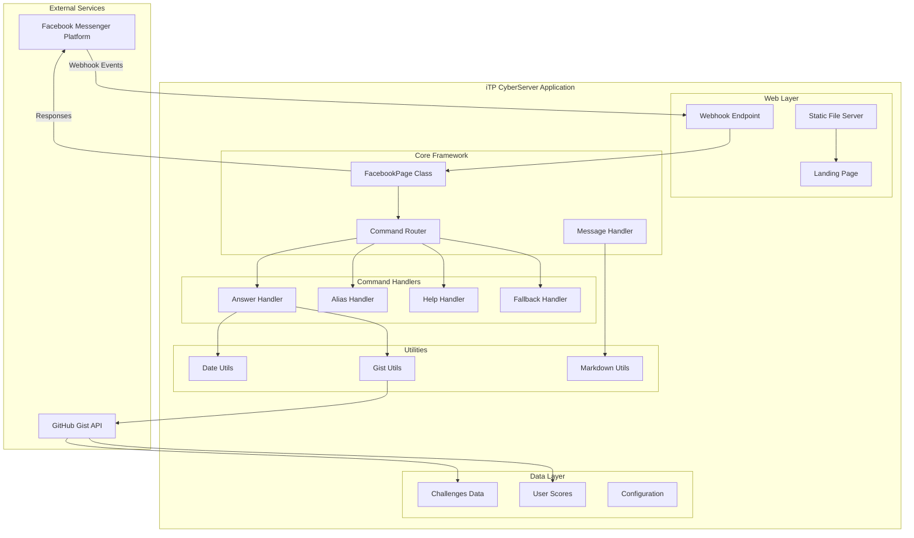
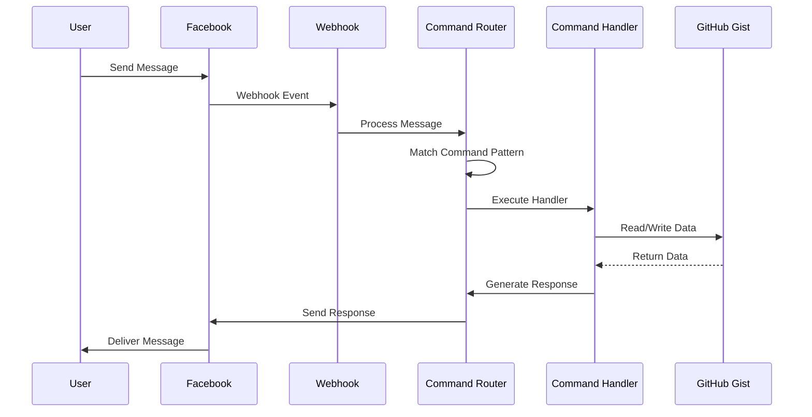
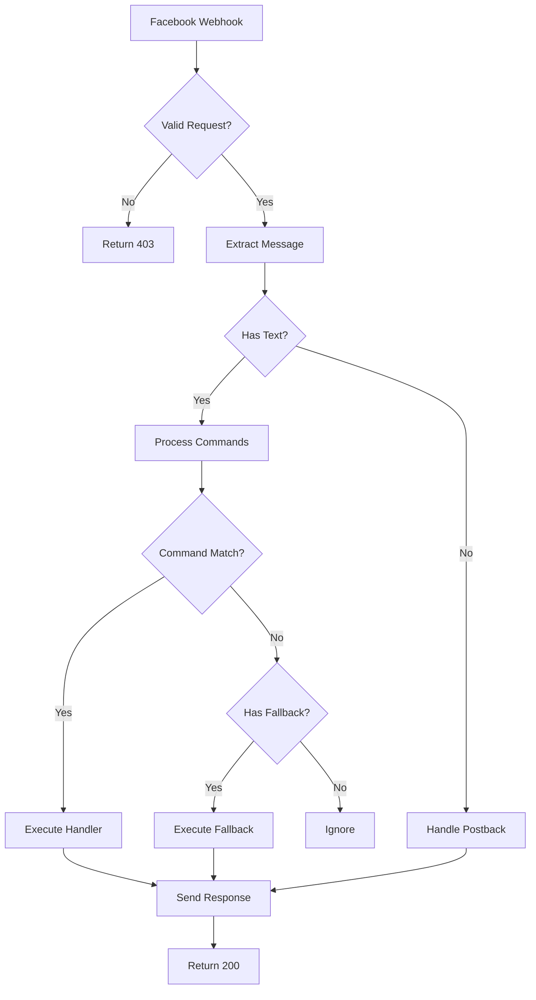
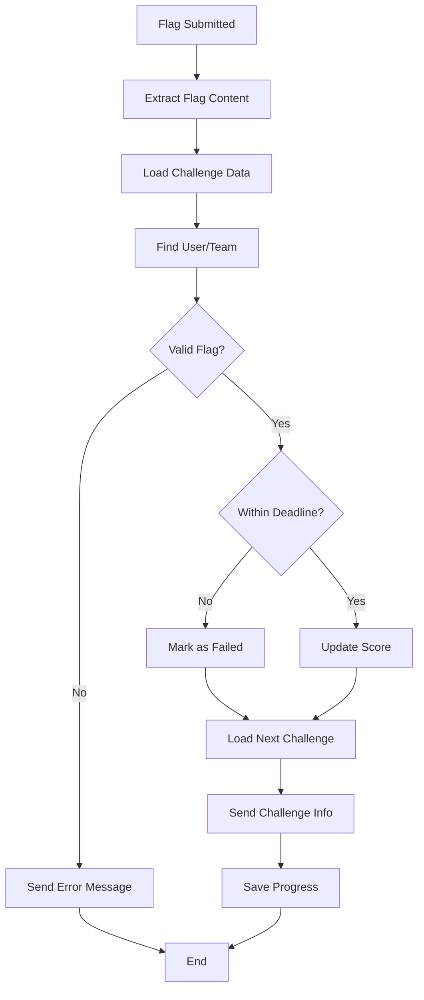

# Architecture Documentation

## System Overview

iTP CyberServer is a Facebook Messenger bot framework designed specifically for Capture The Flag (CTF) competitions. The architecture follows a modular design pattern with clear separation of concerns.

## High-Level Architecture



## Core Components

### 1. FacebookPage Class (`facebook-page/index.js`)

The central orchestrator of the bot framework.

**Responsibilities:**
- Webhook management and validation
- Message routing and processing
- Command registration and execution
- Response handling and rate limiting
- Static file serving
- Admin management

**Key Features:**
- Express.js server integration
- Automatic message chunking for long responses
- File attachment support
- Extensible command system
- Built-in help system

### 2. Command System

#### Command Registration
Commands are registered with configuration objects that define:
- Regex patterns for matching
- Script file associations
- Visibility and access controls
- Case sensitivity options

#### Command Execution Flow


### 3. Data Persistence Layer

#### GitHub Gist Integration
The system uses GitHub Gist as a lightweight database for:
- Challenge definitions and metadata
- User progress and scoring
- Team configurations

**Advantages:**
- Version control for data changes
- Easy backup and recovery
- RESTful API access
- No additional database setup required

**Data Structure:**
```json
{
  "challenges.json": "Challenge definitions with flags and metadata",
  "matches.json": "User/team progress and scoring data"
}
```

### 4. Utility Modules

#### Date Utils (`utils/date.js`)
- Timezone-aware date handling
- Challenge deadline validation
- Consistent time formatting

#### Gist Utils (`utils/gist.js`)
- GitHub API integration
- JSON data serialization/deserialization
- Error handling for API calls

#### Markdown Utils (`utils/markdown.js`)
- Unicode character conversion
- Rich text formatting for messages
- Enhanced visual presentation

## Request Flow

### 1. Incoming Message Processing



### 2. Command Execution Pipeline

1. **Pattern Matching**: Regex-based command identification
2. **Script Loading**: Dynamic require() of handler modules
3. **Context Preparation**: Event object and regex match preparation
4. **Handler Execution**: Asynchronous command processing
5. **Response Generation**: Message formatting and sending

### 3. CTF Flag Validation Flow



## Security Architecture

### 1. Webhook Validation
- Verification token matching
- Request signature validation
- HTTPS enforcement

### 2. Data Protection
- Environment variable isolation
- Token-based authentication
- Secure API communications

### 3. Input Validation
- Regex pattern matching
- Type checking for all inputs
- Sanitization of user data

## Scalability Considerations

### 1. Horizontal Scaling
- Stateless design enables multiple instances
- External data storage (GitHub Gist)
- Load balancer compatibility

### 2. Performance Optimizations
- Message chunking for large responses
- Rate limiting to prevent flooding
- Efficient regex compilation

### 3. Resource Management
- Automatic temporary file cleanup
- Memory-efficient message processing
- Minimal dependency footprint

## Error Handling Strategy

### 1. Graceful Degradation
- Fallback commands for unmatched inputs
- Default responses for system errors
- Continued operation despite individual failures

### 2. Logging and Monitoring
- Console-based error logging
- Structured error messages
- Debug mode support

### 3. Recovery Mechanisms
- Automatic retry for transient failures
- Data consistency checks
- Backup data sources

## Configuration Management

### 1. Environment Variables
- Sensitive credentials isolation
- Runtime configuration
- Platform-specific settings

### 2. Command Configuration
- Declarative command definitions
- Runtime command registration
- Dynamic behavior modification

### 3. Feature Flags
- Maintenance mode support
- Command visibility controls
- Admin-only features

## Integration Points

### 1. Facebook Messenger Platform
- Webhook endpoints
- Graph API integration
- Message formatting compliance

### 2. GitHub Gist API
- RESTful data operations
- Authentication handling
- Version control integration

### 3. Express.js Framework
- HTTP server management
- Static file serving
- Middleware integration

## Development Patterns

### 1. Modular Design
- Separation of concerns
- Reusable utility functions
- Plugin-style command system

### 2. Asynchronous Processing
- Promise-based operations
- Non-blocking I/O
- Concurrent request handling

### 3. Configuration-Driven Behavior
- Declarative command definitions
- Environment-based configuration
- Runtime behavior modification

## Deployment Architecture

### 1. Single Instance Deployment
```
[Load Balancer] → [CyberServer Instance] → [GitHub Gist]
                                        → [Facebook API]
```

### 2. Multi-Instance Deployment
```
[Load Balancer] → [Instance 1] → [Shared Gist Storage]
                → [Instance 2] → [Facebook API]
                → [Instance N]
```

### 3. Containerized Deployment
```
[Container Orchestrator] → [Container 1] → [External Services]
                        → [Container 2]
                        → [Container N]
```

## Future Architecture Considerations

### 1. Database Migration
- Transition from Gist to dedicated database
- Data migration strategies
- Backward compatibility

### 2. Microservices Architecture
- Service decomposition
- API gateway integration
- Independent scaling

### 3. Real-time Features
- WebSocket integration
- Live leaderboards
- Real-time notifications

### 4. Multi-Platform Support
- Discord integration
- Slack compatibility
- Telegram support

This architecture provides a solid foundation for CTF bot operations while maintaining flexibility for future enhancements and scaling requirements.